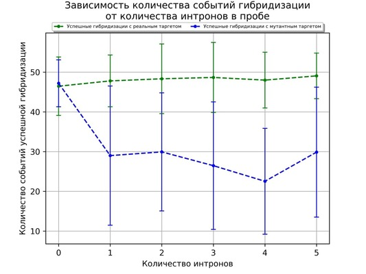
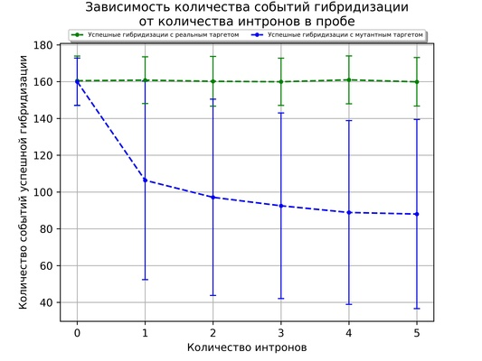

# BI-2020-21-Simulations

## Aim of the project

To simulate relation of hybridization events number from various parameters
of Tyramide-FISH exepriment and to find intriguing patterns.

## Methods

For hybridization outcomes simulation Monte-Carlo approach is used.

## Requirements

Script writed on Python3, list of all required Python packages in
`requirements.txt` file and can be installed in virtual environment using pip

## Simulation output

As a main output of all iterations the function in script is returns
a dictionary with number of hybridization events of four types: real target
hybridization only, mutate target hybridization only, both targets
hybridization only and no hybridization. You can use this output as you want:
save in table (install `pandas` first), draw plots using `pyplot` and
`matplotlib` etc.

### Simulation results representation examples

#### Table form

| IN  | R   | M   | N   | B   |
| --- | --- | --- | --- | --- |
| 0   | 146 | 138 | 499 | 0   |
| 1   | 146 | 85  | 499 | 0   |
| 2   | 146 | 141 | 499 | 0   |
| 3   | 168 | 137 | 499 | 0   |
| 4   | 146 | 138 | 499 | 0   |
| 5   | 146 | 141 | 499 | 0   |
| 0   | 146 | 85  | 499 | 0   |
| 1   | 146 | 103 | 499 | 0   |
| ... | ... | ... | ... | ... |

>IN - introns number
>
>R - real target only hybridization events number
>
>M - mutated target only hybridization events number
>
>N - no hybridization events number
>
>B - both target hybridization events number

Each line is one simulation with certain number of iteration

<!-- [Table example](example_result/example_table.tsv) -->

#### Plot form

As a result of a simulation a plot like this can be created.

## Results

In our simulation it is seen that hybridization events number with mutated
target is less than hybridization events number with real target even after
including in probe a singe intron fragment. Although standart deviation
(whiskers on plot) shows that hybridization events number with mutated target
is not significantly differ from hybridization events number with real target 
for all introns number in probe, we can see some pattern to decrease for
mutated target. This simulation will be improved to achieve result that
better match to reality.

[Plot table](results/result_table.tsv)

## References

Article about influences of introns in probe at probe specificity

Romanov, D., Divashuk, M., Havey, M. J., & Khrustaleva, L. (2015).
Tyramide-FISH mapping of single genes for development of an integrated
recombination and cytogenetic map of chromosome 5 of Allium cepa.
Genome, 58(3), 111-119.
